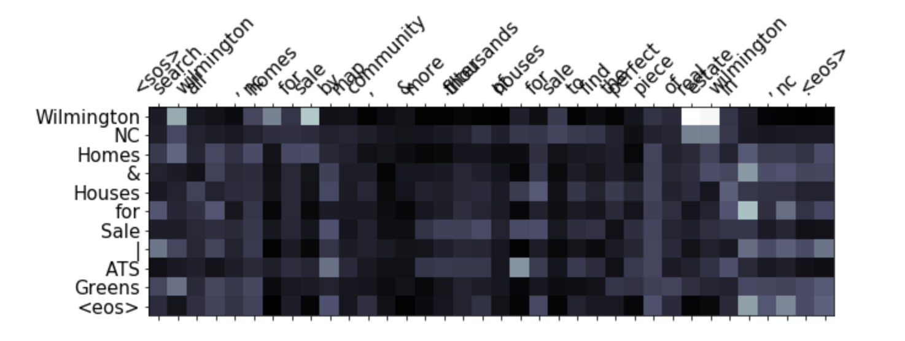

# README #

Implementation of [Distinctive Slogan Generation with Reconstruction](https://www.aclweb.org/anthology/2020.ecomnlp-1.9.pdf).

### Installation 

This repo requires python3 and pip

```

git clone https://akshaybhatia10@bitbucket.org/akshaybhatia10/enc-dec-baseline.git
cd enc-dec-baseline
mkdir outputs/
```

#### Install libraries

```

pip3 install -r requirements.txt

```

The datasets are individual CSV files for training, testing and validation. These must be in the datasets/ folder in the this repo. The trained model is saved in the outputs/ folder.

### Arguments
#### Below are some of the arguments with their default values required by the training script  

- enc_dec_hidden: Number of hidden units for encoder decoder GRUs - int, 512
- bs: Batch size - int, 8
- epochs: Number of epochs - int, 10
- dataset_path: Path to dataset - must have train.csv, test.csv, valid.csv - str, datasets
- vocab_size: Size of vocab - int, 30000
- embed_size: Word Embedding size - int, 200
- copy: Whether to enable copy mechanism or not - store_action i.e True if included else falses
- recons: Whether to enable reconstruction model or not - store_action i.e True if included else falses
- evaluate: Evaluate the model using the pretrained model - store_action, i.e True if included else falses


### Usage
To train the encoder-decoder model only

```

python3 main.py --enc_dec_hidden 512 --bs 8 --epochs 10 --dataset_path datasets --vocab_size 30000 --embed_size 200

```

To train the encoder-decoder model with copy mechanism only

```

python3 main.py --enc_dec_hidden 512 --bs 8 --epochs 10 --dataset_path datasets --vocab_size 30000 --embed_size 200 --copy

```

To train the encoder-decoder model with copy mechanism and reconstruction model - 2020 paper

```

python3 main.py --enc_dec_hidden 512 --bs 8 --epochs 10 --dataset_path datasets --vocab_size 30000 --embed_size 200 --copy --recons

```

To evaluate the trained model:

```

python3 main.py --enc_dec_hidden 512 --bs 8 --epochs 10 --dataset_path datasets --vocab_size 30000 --embed_size 200 --copy --recons --evaluate

```

#### Attention Visualization

Below is a visualization of the generated slogan with its description. The below command will prompt an input in the terminal. Enter your text description and press q to exit.

```

python3 visualize_attention.py

```



#### Evaluation results

- Encoder-Decoder only 2015 paper 
	- Test - R1: 16.74, R2: 4.67, RL: 15.77
	- Valid - R1: 16.45, R2: 4.89, RL: 15.58

- Encoder-Decoder with copy mechanism only 
	- Test - R1: 17.22, R2: 4.48, RL: 16.31
	- Valid - R1: 17.27, R2: 4.65, RL: 16.37

- Encoder-Decoder  with copy mechanism and reconstruction model - 2020 paper
	- Test - R1: 19.32, R2: 5.86, RL: 18.36
	- Valid - R1: 19.35, R2: 5.98, RL: 18.36